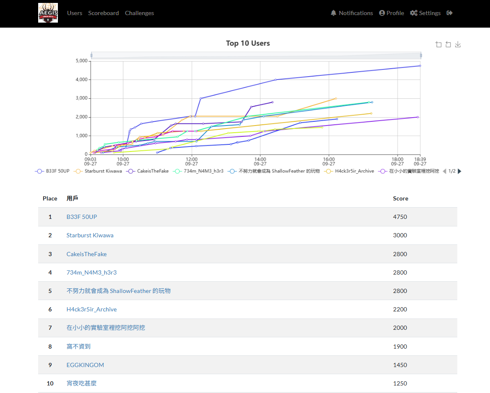

實驗室的大家一起打神盾杯初賽最後順利晉級決賽，大家都超猛的！

```bash title="result"
Team: 在小小的實驗室裡挖阿挖阿挖
Rank: 7/40
```

這次一樣負責的是 Reverse 題目，總共有三題最後只解了兩題，最後一題只差使用 `Unicorn Engine` 模擬起來應該就成功解了。

## Reverse

### gochal


一個輸入框檢測輸入的 flag 是不是正確的。


丟 DIE 可以知道是 `golang` 寫的。

---

')

丟進 IDA 後在 `main` 的地方可以看到有一個吃輸入的地方並且最關鍵的 `main_checkFlag()` 看起來把裡面的邏輯逆向完就可以拿到結果。

')

經過觀察可以發現在第 87 行做完一些解密動作後會使用 `runtime_memequal()` 去比較解密後的值跟使用者的輸入。


這邊直接動態跑起來停在 `runtime_memequal()` 的位置去查看 v32 的值就可以拿到 **flag**。

:::flag
AEGIS{Go_for_broke_in_this_game!}
:::

### Call Back


一開始執行會顯示沒辦法開檔案。

---


可以在 `sub_7FF6171E11C0()` 底下看到這邊有進行開 `flag.txt` 的動作，這邊會把 txt 裡面的值讀進來。


:::important
開檔之後往下執行就會碰到一大塊的記憶體複製操作，大致上就是把 `sub_7FF6BBE05040()` 這個 function 複製到一塊新的記憶體位址。
:::


點進去後這個 `sub_7FF6BBE05040()` 這格 function 看起來就超級像是解 flag 之類的，`a1` 是使用者輸入。
第一個迴圈會把奇數位的 byte 跟偶數位的 byte 進行交換並存到 `v8` 裡面。
第二個迴圈會把剛剛處理完的 `v8` 一次拿 4 個 bytes 出來算完後 or 起來

- 每個 byte 都會被 `* 2 ^ 0x94E590 + 20`
- 第 0 個 byte 算完後右移 24 個 bits
- 第 1 個 byte 算完後右移 16 個 bits
- 第 2 個 byte 算完後右移 8 個 bits
- 第 3 個 byte 不移動

最後才會去比對 v12 值。所以根據剛剛的計算寫一個反推 script，解題當下是用 ChatGPT 生成的 code 解決，後續才去分析上述的行為。

```python title="solve.py"
# 反推並驗證 sub_7FF6171E5040 的輸入
import struct

v12 = [
    0x6E6732F63277168A,
    0x426306DC420BFEF2,
    0x5A5BFCC65C8956D8,
    0x62397CD2602358EA,
    0x42230CD8142F2AE6
]
v13 = 1847588040
# build expected 44 bytes (little-endian in-memory)
target = b"".join(struct.pack("<Q", x) for x in v12) + struct.pack("<I", v13)

C = 0x94E590
v8 = [0]*44
for j in range(0, 44, 4):
    V = (target[j] << 24) | (target[j+1] << 16) | (target[j+2] << 8) | (target[j+3])
    X = (V - 20) & 0xFFFFFFFF
    Y = X ^ C
    v2 = (Y >> 1) & 0xFFFFFFFF
    v8[j+0] = (v2 >> 24) & 0xFF
    v8[j+1] = (v2 >> 16) & 0xFF
    v8[j+2] = (v2 >> 8)  & 0xFF 
    v8[j+3] = v2 & 0xFF

# a1 is v8 with pairwise swap inverted: a1[n] = v8[n ^ 1]
a1 = bytes(v8[n ^ 1] for n in range(44))
print("recovered:", a1)
print("as ascii:", a1.decode())
```

:::flag
AEGIS{eA5y_wIn_Call64ck_function_sHeLl_c0de}
:::

---

::github{repo="xAdb2/CTF-source-upload"}