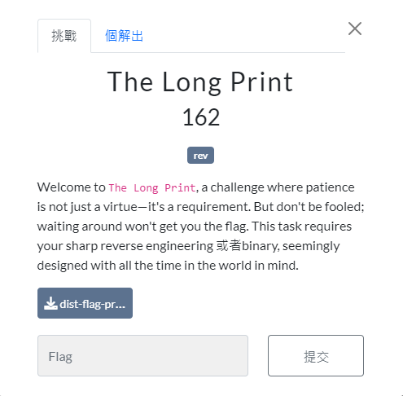

::github{repo="xAdb2/CTF-source-upload"}

## Misc

### Welcome


:::flag
AIS3{Welc0me_to_AIS3_PreExam_2o24!}
:::

### Quantum Nim Heist


題目使用`nc`連線。可以看到這是一個拿石頭的遊戲。
- 每次選擇一列跟拿幾顆石頭。
- 最後一個沒有石頭拿的人就會輸遊戲。
- 目標讓電腦拿不到石頭。
- `正常玩遊戲一定贏不了電腦。`


輸入超過當前的列數，跳出這是非法的操作。


發現可以有數字以外的輸入，這邊就一直輸入`o`直到剩最後一顆石頭我們在直接拿走就可以拿到 FLAG。

:::flag
AIS3{Ar3_y0u_a_N1m_ma57er_0r_a_Crypt0_ma57er?}
:::

### Three Dimensional Secret


檔案下載下來後只給了一個`.pcapng`檔案。


這邊簡單使用`strings`查看裡面有甚麼東西，上網查找發現這是一種叫做`G-code`的東西，專門用來 3D 列印的。


把這段`G-code`貼到這個網站[NC Viewer](https://ncviewer.com/)就可以拿到答案。

:::flag
AIS3{b4d1y_tun3d_PriN73r}
:::

## Reverse

### The Long Print



執行後會有一個地方印 flag 可是印的很慢。


:::important
使用 IDA 打開可以看到會迴圈輸出FLAG，只是每次輸出前都會`sleep`很久。
:::

所以這邊直接把 sleep 的時間 patch 成 0x1，就可以讓程式自己把 flag 印出來。

:::flag
AIS3{You_are_the_master_of_time_management!!!!?}
:::

### 火拳のエース


執行後會很緩慢印出 flag 的一小部分。


使用 IDA 開啟查看 main function。

- Line 22
  - 此`print_flag()`就是前面緩慢印出的部分。
- Line 23 - 45
  - 使用者輸入 32 個字後分到 4 個 buffer 裡面。
  - buffer 會經過`xor_strings()`再來`complex_function()`。
  - buffer 更改完後會去跟字串對比。
- 所以解題思路是先把`complex_function()`反推再把`xor_strings()`反推。


接下來繼續逆向`complex_function()`。

- `a1`(更改前的buffer)是我們要拿到的最終目標。
- `a2`是已知的值，也就是迴圈數加上特定數。
- `v5`的值是知道`a1`的關鍵。
- Line 7 - 11
  - a1的範圍有被限制，通過 ascii 可以知道是`@`跟`A~Z`。
- Line 12
  - 把`a1`跟`a2`做計算得到的**v5**會往下做剩下的加密。
- Line 15 - 30
  - 會依照不同的條件判斷做相對應的加密。
    - `v5 = (v5 - v4 + 26) % 26`
    - `v5 = (2 * v4 + v5) % 26`
    - `v5 = (v4 * v5 + 7) % 26`
- Line 31
  - 會把加密後的值再加上65，所以回推時要注意。
- 重點就是把這3個算式回推，以第一個為例`v5 = (v5 - v4 + 26) % 26`。
  - `v4`是一個固定的值不需要推算。
  - 左邊的`v5`是扣完==65==後的`v5`。
  - 將`(v5 - v4 + 26)`假設為`x`。
    - `v5 = x % 26`
  - 可以使用一個迴圈去假設`x`的值。
    - `x = 26 * i + v5` 
    - `x = (v5 - v4 + 26)` 可以對此算式移項。 
    - `v5 = x + v4 - 26`
  - 這樣我們就可以得到一個有可能的`v5`的值，再來透過**Line 12**可以回推到`a1`的值。
  - 透過**Line 7**可以去檢查此`a1`是否在範圍內。
    - True: 就可以得到`a1`。
    - False: 迴圈可以進行下一圈。


這邊把 buffer 的值 xor 他設定好的值，所以這邊採用動態找到他設定好的值的位址並做xor即可。接下來把上面所有的 function 用 python 寫逆推。

```python title="solve.py"
compare_key0 = "DHLIYJEG"
compare_key1 = "MZRERYND"
compare_key2 = "RUYODBAH"
compare_key3 = "BKEMPBRE"

buffer0 = [0] * 8
buffer1 = [0] * 8
buffer2 = [0] * 8
buffer3 = [0] * 8

def inverse_complex_function(key, a2):
    #v5 = (17 * a2 + a1 - 65) % 26 
    v5 = ord(key) - 65
    v4 = a2 % 3 + 3
    v2 = a2 % 3
    if a2 % 3 == 2:
        #v5 = (v5 - v4 + 26) % 26
        count = 0
        while True:
            origin_v5 = get_origin(v5, count) + v4 - 26
            a1 = check_a1(origin_v5, a2)
            if a1 == -1:
                count += 1
            else:
                return a1

    elif v2 <= 2:
        if v2:
            if v2 == 1:
                #v5 = (2 * v4 + v5) % 26
                count = 0
                while True:
                    origin_v5 = get_origin(v5, count) - (2 * v4)
                    a1 = check_a1(origin_v5, a2)
                    if(a1 == -1):
                        count += 1
                    else:
                        return a1
        else:
            #v5 = (v4 * v5 + 7) % 26
            count = 0
            while True:
                origin_v5 = (get_origin(v5, count) - 7) / v4
                if int(origin_v5) * 10 == origin_v5 * 10:
                    origin_v5 = int(origin_v5)
                    a1 = check_a1(origin_v5, a2)
                    if(a1 == -1):
                        count += 1
                    else:
                        return a1
                else:
                    count += 1

def get_origin(remainder, count):
    return 26 * count + remainder

def check_a1(origin_v5, a2):
    count = 0
    while True:
        a1 = get_origin(origin_v5, count) + 65 - (17 * a2)
        if a1 > 64 and a1 <= 90:
            return a1
        elif a1 > 90:
            return -1
        else:
            count += 1

for i in range(8):
    buffer0[i] = inverse_complex_function(compare_key0[i], i)
    buffer1[i] = inverse_complex_function(compare_key1[i], i + 32)
    buffer2[i] = inverse_complex_function(compare_key2[i], i + 64)
    buffer3[i] = inverse_complex_function(compare_key3[i], i + 96)

xor0 = ["\x0E", "\x0D", "\x7D", "\x06", "\x0F", "\x17", "\x76", "\x04"]
xor1 = ["\x6D", "\x00", "\x1B", "\x7C", "\x6C", "\x13", "\x62", "\x11"]
xor2 = ["\x1E", "\x7E", "\x06", "\x13", "\x07", "\x66", "\x0E", "\x71"]
xor3 = ["\x17", "\x14", "\x1D", "\x70", "\x79", "\x67", "\x74", "\x33"]

result0 = '' 
result1 = ''
result2 = ''
result3 = ''

for i in range(8):
    result0 += chr(buffer0[i] ^ ord(xor0[i]))
    result1 += chr(buffer1[i] ^ ord(xor1[i]))
    result2 += chr(buffer2[i] ^ ord(xor2[i]))
    result3 += chr(buffer3[i] ^ ord(xor3[i]))

print(result0 + result1 + result2 + result3)
#_D4MN_4N9R_15_5UP3R_P0W3RFU1!!!}
```

:::flag
AIS3{GOD_D4MN_4N9R_15_5UP3R_P0W3RFU1!!!}
:::

### faker's Really OP meow way


執行後可以看到一個劫的表情xd


- Line 41 - 42
  - `readfile()`這個 function 會去把檔案打開並讀取內容。
  - 所以先創一個空的`flag.txt`在同一個dir底下。
  - 剩下的亂數是系統原本就有的。
- Line 43
  - 進行 server 的連線。
  - 把剛剛的取得的亂數上傳至伺服器。
- Line 49
  - 讀取伺服器回傳的值。
- Line 50
  - `s1`是使用者的輸入進行加密後的值。
  - `s2`是用來比對是否正確的(動態分析時可以拿到)。


:::important
這邊看似讀取完服務器上的值就結束了，實則動態分析後可以發現`ROP`。
:::


稍微逐步執行了一下可以發現以下事情
- 會不斷執行3種操作
  - add(i % 3 == 0)
  - sub(i % 3 == 1)
  - xor(i % 3 == 2)
- `al`是使用者放在flag.txt裡面的值。
- `bl`是將先前產生的亂數跟真實flag做以上操作的反推版本。
- 將斷點設在讀取亂數時，取得當前亂數。
- 使用逐步分析拿取`bl`的值(有點土法煉鋼，好險值並不是很多)。

```python title="solve.py"
#bl
op_key = ["\x7F", "\xF7", "\x8C", "\x2B", "\xB4", "\xFD", "\x54", "\xBD", "\x80", "\x49", "\x0A", "\x4A", "\x75", "\xF4", "\xD2", "\x2D", "\xB1", "\x72", "\xC3", "\x4F", "\xBE", "\x63", "\x24", "\xE7", "\x01", "\x97", "\xFD", "\x01", "\x4F", "\x06", "\xB0", "\x4B", "\xC3", "\x86", "\x68", "\xB1"]
#s2
cmp = ["\xC0", "\x52", "\xDF", "\x5E", "\xC7", "\x8F", "\x87", "\xB9", "\xB3", "\xBB", "\x2B", "\x7B", "\xE3", "\x42", "\x8D", "\x9F", "\x7F", "\x02", "\x22", "\xE2", "\x8B", "\xC2", "\x3F", "\xD7", "\x31", "\xD5", "\xA2", "\x73", "\xE2", "\x30", "\x18", "\xEC", "\xFC", "\xC5", "\xD7", "\xCC"]
#al
result = ""

for i in range(len(op_key)):
    br = i % 3
    if br == 0:
        if ord(cmp[i]) - ord(op_key[i]) < 0:
            result += chr(ord('\xFF') - ord(op_key[i]) + ord(cmp[i]) + 1)
        else:
            result += chr(ord(cmp[i]) - ord(op_key[i]))
    elif br == 1:
        if ord(cmp[i]) + ord(op_key[i]) > 126:
            result += chr(ord(cmp[i]) - 256 + ord(op_key[i]))
        else:
            result += chr(ord(cmp[i]) + ord(op_key[i]))
    else:
        result += chr(ord(cmp[i]) ^ ord(op_key[i]))

print(result)
```

:::flag
AIS3{r3v3r51n6_r0p_15_c00l_r16h7???}
:::