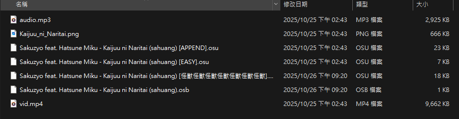
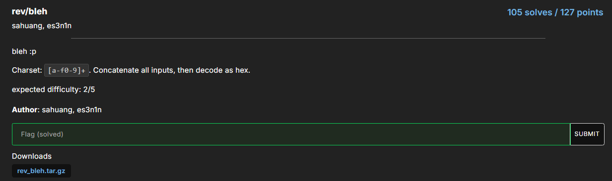

這次跟`竹狐`一起打 **OSU**，好玩遊戲每天要玩。

有點可惜要趕禮拜一的報告只有小打一下，但還是寫一下解出來題目的 Write up。

::github{repo="xAdb2/CTF-source-upload"}

## Kaijuu

### sanity-check


這題其實有兩個解法，但首先要先找到這題的 osu 音樂的頁面。


:::important
找到後如果眼尖其實就可以在 tag 的地方看到 flag 了。
:::

但很明顯的我完全沒看到，所以我的解法是把這題的 `.osz` 檔案下載下來。



載下來後把 `.osz` 丟到 OSU 裡面就可以自動解壓縮並且在 OSU 底下的 Songs 資料夾找到我們下載下來的歌跟影片跟譜面等等的資料。

:::tip
後來才知道可以把 `.osz` 直接改成 `.zip` 就可以解壓縮拿到裡面的檔案。
:::

```bash
[Metadata]
Title:Kaijuu ni Naritai
TitleUnicode:怪獣になりたい
Artist:Sakuzyo feat. Hatsune Miku
ArtistUnicode:Sakuzyo feat. 初音ミク
Creator:sahuang
Version:EASY
Source:プロジェクトセカイ カラフルステージ! feat. 初音ミク
Tags:Kaijuu ni Naritai I Want to Be a Kaiju hatsune miku project sekai championship vocaloid Sakuzyo 削除 osu{APPEND_38_Goes_Crazy}
BeatmapID:5362823
BeatmapSetID:2454199
```

把其中一個 `.osu` 檔案丟到 vscode 打開可以在 Metadata 下面的 Tags 看到 flag。

:::flag
osu{APPEND_38_Goes_Crazy}
:::

## Reverse

### bleh




:::important
檔案下載下來後解壓縮，裡面有從 0~3841 編號的 ELF 檔案。
:::


丟進 IDA 裡面做逆向，可以看到他把 `PL4YING_CTFS_ISNTBETTER_THAN_OSU` 複製到 `v7` 裡面，最後把使用者輸入 `s` 跟 `v7` 一起丟到  `sub_1337()` 去做運算再跟 `s2` 做比較。

```python title="AI solve_angr.py"
# solve_with_angr.py
import angr
import claripy
import sys

BINARY = "./bleh0"   # <- 改成你的二進位檔名（可執行檔）
L = 32

proj = angr.Project(BINARY, load_options={'auto_load_libs': False})

# 建立 symbolic stdin
flag_chars = [claripy.BVS(f'c{i}', 8) for i in range(L)]
flag = claripy.Concat(*flag_chars)
argv = [BINARY]
state = proj.factory.full_init_state(args=argv, stdin=flag)

# 限制輸入位元為可列印（可選，但比較常見）
for k in flag_chars:
    state.solver.add(k >= 0x00)
    state.solver.add(k <= 0xff)
    # 若你想只找 ascii printable:
    # state.solver.add(k >= 0x20)
    # state.solver.add(k <= 0x7e)

simgr = proj.factory.simulation_manager(state)

# 找到印出 "Nicely done" 的位置：我們可以用 find by stdout substring
def found_fn(s):
    try:
        out = s.posix.dumps(1)
        return b"Nicely done" in out
    except:
        return False

simgr.run(n=400)  # optional cap
found = None
for st in simgr.deadended + simgr.active + simgr.stashes.get('found', []):
    if found_fn(st):
        found = st
        break

# 如果 simgr 有提供 find API 可使用 (更直接):
# simgr.explore(find=lambda s: b"Nicely done" in s.posix.dumps(1), n=1)

if found is None:
    # 嘗試探勘（explore）
    simgr = proj.factory.simulation_manager(state)
    simgr.explore(find=lambda s: b"Nicely done" in s.posix.dumps(1))
    if simgr.found:
        found = simgr.found[0]

if not found:
    print("沒有找到解。你可以加大探索深度或放寬約束。")
    sys.exit(1)

concrete = found.solver.eval(flag, cast_to=bytes)
print("找到輸入（raw bytes）：", concrete)
# 若是可列印 text，印出：
try:
    print("as text:", concrete.decode('latin-1'))
except:
    print("無法 decode 為可見文字，印 hex：", concrete.hex())
```

這邊 AI 直接給了我一個 angr 的 code 嘗試去跑跑看。也確實有炸出答案是 `ffd8ffe000104a464946000101010060`。
:::important
ffd8 很明顯就是 jpg 格式的開頭。
:::

到現在就可以猜到解法應該是把每個 ELF 檔案解出來的答案串在一起應該就是一張圖片，並且這張圖片應該會帶有 flag 的資訊。
但我原本的 angr 就需要跑 1~2 分鐘，如果我有 **3841** 個也不太可能每個慢慢炸，所以我也請 AI 幫我把 `sub_1337()` 的邏輯逆推寫成 python，並且每個 ELF 會變動的值 (s2, v11, v12, v13)的位址也是固定的，找到這些資訊然後跟 AI 激烈溝通一番把 code 改好就可以把 hex 丟到 cyberchef 拿到圖片。

```python title="solve.py"
from pathlib import Path

KEY = b"PL4YING_CTFS_ISNTBETTER_THAN_OSU"

def sub_1C9(a, n):
    return (a + n) & 0xFFFFFFFF

def sub_280(a, n):
    return (a - n) & 0xFFFFFFFF

def sub_337(a1, a2, a3):
    v14 = sub_1C9(a1, 6)
    v10 = sub_1C9(a2, 128)
    v6  = sub_280(a3, 128)
    t = (v6 + (v10 ^ v14)) & 0xFFFFFFFF
    return t & 0xFF

def recover_s_from_q_bytes(q_bytes):
    target = q_bytes
    state = 0x1337
    recovered = bytearray(32)
    for i in range(32):
        desired = target[i]
        found = None
        for c in range(256):
            if sub_337(c, KEY[i], state) == desired:
                found = c
                break
        if found is None:
            return None
        recovered[i] = found
        state = desired
    return bytes(recovered)

s = b""  # <-- 用 bytes

for i in range(3842):
    input_file = "bleh" + str(i)
    path = Path(input_file)
    with path.open("rb") as f:
        f.seek(0x15BA)
        q_bytes = f.read(8)
        f.seek(0x15C4)
        q_bytes += f.read(8)
        f.seek(0x15D6)
        q_bytes += f.read(8)
        f.seek(0x15E0)
        q_bytes += f.read(8)

    print(f"[{i}] q_bytes: {q_bytes.hex()}")
    recovered = recover_s_from_q_bytes(q_bytes)
    if recovered is None:
        print(f"    [!] failed to recover s from {input_file}")
        continue

    s += recovered  # <-- bytes 相加
    print(f"    Recovered s length so far: {len(s)}")

# 最後可以寫成檔案
with open("all_recovered.bin", "wb") as f:
    f.write(s)
print(f"[+] Finished! Total bytes: {len(s)}")
```


:::flag
osu{bl3h_bleh_b13h_m4n_1_l0v3_aut0_r3vs_e4fb25f}
:::

### tosu-1


(題目一開始還沒有給 Note 的敘述)


下載解壓縮之後只有兩個檔案，分別是 `tosu.exe` 跟 `chal1.map` 使用 command Line 的方式把 `chal1.map` 當作參數就可以開始玩音樂遊戲了。結束後畫面也會把剛剛的分數結果印出來只是在最下面可以觀察到有一個可能會印出 flag 的地方。


可以看到遊戲畫面左上角有一些數據統計，並且遊戲結束後也有一行寫著 `flag`，所以先從查看 IDA 裡面哪裡帶有 `flag` 字樣，再使用 xrefs 去找到使用的地方。


")

這邊是 flag xrefs 過來的地方，可以看到這邊就是**結算畫面印出**的位置。


剛剛命名完之後往上看可以觀察到每次按下之後要加多少分，`judge_value` 的值紀錄了按下之後要加多少分。


再往上看一點也可以找到處理 miss 的地方，通過觀察我也發現他們在記錄完按下哪顆按鈕後就會呼叫 `maybe_decrypt()` 的 function，會這樣命名也是因為點進去後發現看起來很像加解密邏輯的地方。

")

真正看起來有像是加解密的地方在 `maybe_main_decrypt_logic()` 裡面，稍微分析一下這裡在做甚麼，`v5` 會拿 judge_value - 1 並且有一堆 if 條件式。
:::important
這些 if 條件會因為 judge_value 設定不同的值給 `maybe_main_decrypt_logic()`，這個值也是最後一個參數。
:::
再仔細觀察一下，可以看到當 judge_value 是 3 時的行為會跟其他值有點不一樣，差在沒有 `*(_BYTE *)(maybe_encrypt_flag + 49) = 1;`，所以當時就判斷因為是音樂遊戲所以可能是要 full combo 並且都是 300 分( judge_value 為 3 )就可以拿到 flag。


當時在我有這個想法之後`竹狐`的 whiteskull 也是這樣的做法，並且發現印出 flag 的地方還是一樣。最後就在比賽要結束的半夜我突然看到官方有給提示，也就是剛剛上面說到的 Note。

:::note
Note: If your solver isn't working and you're confident that it seems correct but still can't get the flag, try achieving the perfect score with no reflection of it in the GUI. Essentially, you should have a perfect score without ever touching the circles, and the counts on the final screen should all be zero except the miss count, which should be 1080. (It will make sense if you're stuck in that place)
:::

這段話的大意就是**獲得完美的分數(也就是全部 300 分)並且不用真的去按到這些圈圈，最後結算的 miss count 要有 1080(全部圈圈數)**，我當時就覺得這也很矛盾，我要都打到 300 分可是 miss count 那邊又是要全部 miss。

不過當時也沒太多想法，就想說如果我都不按確實 miss 那邊就會是 1080，那如果又要是 300 分的判斷結合剛剛前面的分析，我就把原先 miss 那邊呼叫 `maybe_decrypt()` 時本來 judge_value 都是固定送 4，我把它 `maybe_decrypt()` patch 成固定都送 **3**，也就是打最好時的 judge_value 值，然後再跑一下。

```bash title="before patch"
maybe_decrypt((__int64)&maybe_encrypt_flag, v7, 4u, (unsigned int *)(v8 + qword_7FF7D2C8B020));// 這邊 v2 只會送 4
```

```bash title="after patch"
maybe_decrypt((__int64)&maybe_encrypt_flag, v7, 3u, (unsigned int *)(v8 + qword_7FF7D2C8B020));// 這邊 v2 只會送 4
```


更改完之後重啟遊戲確實就在 Flag 的地方印出答案了，我覺得這題我也算是矇到，或許提示也不是那個意思.. 但就被我這樣搞出來了。

:::flag
osu{cl1ck_7h3_c1rcl35_w1th_n0_b34t} 
:::